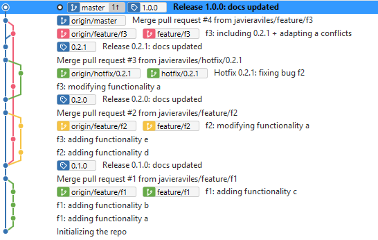

# Code&Bricks E-commerce using tbd

**This is an example exercise**. The company Code&Bricks wants to develop a new E-commerce webapp. The dev team will develop a first `1.0.0` version including three features. Each of them will be released as soon as its developed.

All involved branches are pushed and left untouched so the exercise looks as clear as possible. Also will not squash features for this same purpose. Will use PRs with short branches. Ideally every feature would be **squashed and merged** and the branch **would be deleted**, then master would look nice and clean.

  - [Timeline:](#timeline)
  - [Git History](#git-history)
  - [Changelog](#changelog)
    - [Release 0.1.0](#release-010)
    - [Release 0.2.0](#release-020)
    - [Release 0.2.1](#release-021)
    - [Release 1.0.0](#release-100)

## Timeline:
- f1 feature should be developed and delivered as soon as possible (release 0.1.0)
- f2 and f3 are developed in parallel
- f2 gets finished and released (release 0.2.0)
- a bug is found in prod, hotfix delivered (release 0.2.1)
- f3 gets finished and released, taking care of conflicts and including hotfix (1.0.0)

## Git History

## Changelog
### Release 0.1.0
- New Feature 1 [PR#1](https://github.com/javieraviles/fj.aviles.2019-tbd/pull/1)
### Release 0.2.0
- New Feature 2 [PR#2](https://github.com/javieraviles/fj.aviles.2019-tbd/pull/2)
### Release 0.2.1
- Fix for Feature 2 bug [PR#2](https://github.com/javieraviles/fj.aviles.2019-tbd/pull/3)
### Release 1.0.0
- New feature 3